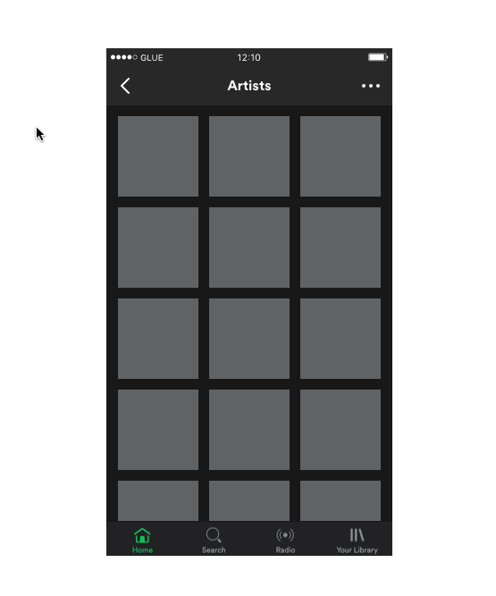
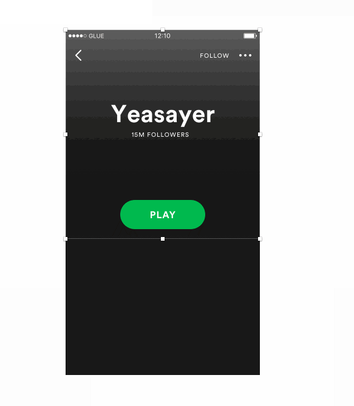

# Spotify Sketch Plugin

A Sketch plugin for loading Spotify content from the web api into Sketch documents.

### Artist Photos by Top Artists

Select one or more vector layers. This uses the US top 50 playlist from the Spotify user account, pulling the photo of the artist for each track in the playlist. For each vector layer in your selection, it adds an image fill which contains the artist's photo.

### Artist Photo by Artist Search

Select a vector layer, and run the command. Type the name of an artist whose photo you would like to use, and it will grab the closest match. If multiple artists match, it will return the artist with the highest popularity. For example, "Frank Sinatra" will return the photo for Frank Sinatra, but "Frank" will return the photo for Frank Ocean. An image fill will be set on your selected layer with the photo of the artist returned.

## Album Art

### Album Art by Top Albums

Select one or more vector layers. This uses the US top 50 playlist from the Spotify user account, pulling the album art for each track in the playlist. For each vector layer in your selection, it adds an image fill of the album art.

### Album Art by New Releases

Select one or more vector layers. For each vector layer in your selection, it adds an image fill of the album art for an album in New Releases.

### Album Art by Artist Search

Select a vector layer, and run the command. Type the name of an artist whose album art you would like to use, and it will grab the closest match. If multiple artists match, it will return the album art for the artist with the highest popularity. For example, "Frank Sinatra" will return Frank Sinatra, but "Frank" will return Frank Ocean. For each vector layer in your selection, an image fill will be set on your selected layer with one of that artist's album's art.
